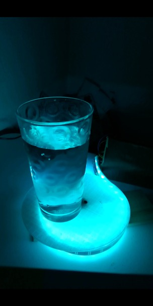

# Water Time
## What is the title of your project?
WATER TIME
## Briefly explain why did you want to make this project?
Study has shown that across the world, at all stages of life, most people live in a status of dehydration. The average American only drinks 1.8 cups a day which is significantly less than the 8.5 cups a day that are recommended by the European Hydration Institute. It takes only a 2% loss of total water content for your body to start feeling thirsty. Once you’re at this point your body is already in a state of dehydration. The most recommended way to keep ourselves hydrated is regular water intake. Therefore, I want to make a machine that can reminds people to drink water regularly.

## Who are the stakeholders?
Anyone who has a busy schedule and often forgets to drink water to keep hydrated. For example: students, teachers, office workers.
## Find 3 Inspiring Projects
 
## **Code**
[Final Codes](./WaterTime.ino)
## How does your program work? (Explain your code)
* When a user put a container with water on the shelf, the Arduino starts to read the input of amplified value of the Load Cell. The LED strip will start changing color indicating that it is measuring the weight. (**lightBlinking (c1,c2,500);**). **flagCup** will change from 0 to 1, indicating a container has been put on the shelf.
* I set a variable called **stable** to see whether the input is stable or not. Once the flunctuation is less than 4, **stable** increases 1. Once stable reaches the standard that was set for the "stable state", the **flagTimingState** changes from 0 to 1, the machine will store the weight it measures and start timing. The LED strip will turn to light blue and start fading in and out (**lightBreathing(waitingColor);**).
* Once the container is lifted up, the input of the Load Cell will fall under a threshold(40). The LED strip will become green and start fading in and out (**lightBreathing (c2);**).
* If the container is lifted up during the prescribed water-drinking intervals, which means the LED has not turned to alarming color - red (**flagAlert = 0**), **flagCup** will change from 0 to 3, indicating a container which was on the shelf before has been lifted up prior to the prescribed drinking time. Everything will start over. All the flag variables will be reset to initial value. And the timer will start over.
* If the container hasn't been moved for a prescribed period of time, **flagAlert** will change from 0 to 1. The LED strip will turn to red and start blinking. (**lightBlinking (c1,c2,300);**)
* Now, if the the user raises the container after the interval, **flagCup** will change to 2 indicating that the container is lifted after the the time the user is supposed to drink water.
* If the user puts back the container after drinking enough amount of water, everything will start over. All the flag variables will be reset to initial value. And the timer will start over.

## **Reflection**
## What worked/did not work?
* What worked: the LED lights. The load cell and HX711 work well together to measure weight.
* What didn't work: The LED strip cannot change color from a marquee mode. The function **strip.clear() strip.fill(color2,0,NUMPIXELS-1); strip.show();** does not work. The strip will stop there in the marquee mode.

## If you had more time what would you change in your project?
* Change the light effect. Right now the light fading in and fading out is not very obvious within a short period of time - it is slow. I would figure out how to let it fade in and fade out smoothly, within a short period of time.
* Add the effect of silhouette of two icons showing up when it is time to drink water.

## **Components**
## What parts did you use?
### PARTS FOR INPUT
* Load Cell
  I need an input that can measure the weight.
* HX711
  It helps amplify the change of the value from the load cell so that it can be read by Arduino.
### PARTS FOR OUTPUT
* LED strip

## Which are your inputs/outputs
### INPUT
The input is the weight of the container that users put on, including the water in it.
* Users put a container with water on the container shelf to trigger the machine.
* Once something is put on it, Water Time will start to measure its weight. It takes a few seconds for the machine to get a stable measurement and then it starts timing.
* If users lift up the container, the weight will become 0 and the machine will know that the container has been moved off the shelf.
* Once users finish drinking water and put the container back on the shelf, Water Time will start to measure its weight again.
### OUTPUT
The output is the LED strip. The color, the frequency of lights.
* When the machine is measuring the weight of container put on it, the LED strip will turn to blue and start blinking (technically, it will start changing color between two kinds of blue. I did not let it blink because the light of the LED strip is too bright and it might make users eyes hurt if it's blinking.)
* Once the measurement becomes stable and the machine starts to time, the LED strip will turn to light blue and start fading in and out.
* As long as the container is moved off the shelf, the LED strip will become green and start fading in and out, indicating users are drinking water.
* If the container haven't been moved for a certain period of time, which means users haven't drunk water for a long time, the LED strip will turn to red and start blinking.
* Once users drink enough water, everything will become normal again. The timer will start over.

## **Interaction**
## Create a layout for your interface
 
## Draw a step by step diagram of the interaction
 
## Explain how the project is used
Users put a glass of water on the base and the machine will start scaling its weight and save it. If users haven't drunk for a given period of time, the machine will start giving alarms (the red light and will start blinking). If the user drinks enough water and put the cup back, the LED strip will turn back to blue and start fading in and out. While the user is drinking water, the LED strip will change to green and start fading in and out, indicating the cup is being lifted off the base.
## How does the user interact with the input
Users only need to put a glass of water on the base which has a sensor below. The machine will read the weight of the glass of water to see whether the user has drunk it or not.
## Why did you decide to use that component?
Because I need a sensor to measure the weight of what is put on the base. The combination of a load cell and a HX711 can measure rather stable weight.

## Explain how the input translates to the output?
The change of weight of the cup of water will indicate different status. The change of LED strip will respond to different status.
* When the force is applied to the sensor - the LED strip will turn to blue and start blinking.
* Once the measurement becomes stable and the machine starts to time - the LED strip will turn back to blue and start fading in and out.
* When no force is applied to the base - the LED strip will change to green and start fading in and out, indicating users are drinking water.
* If the force hasn't changed after a given period of time - the LED strip will turn to red and start blinking to remind users it's time to drink water.
* If the force applied to the base changes a lot from the previous force - the LED strip will turn back to blue and start fading in and out.
## Talk about what form factor/size your project would ideally be.
This project would ideally be a book-size.

## **Images and Videos**
## Progress images
 
 
## Finished input
 
## Finished output
 
 
## Finished Breadboard
 
## Finished Project (Encased)
 
## Video
[Water Time!](https://youtu.be/JlAdSD8pkvM)
