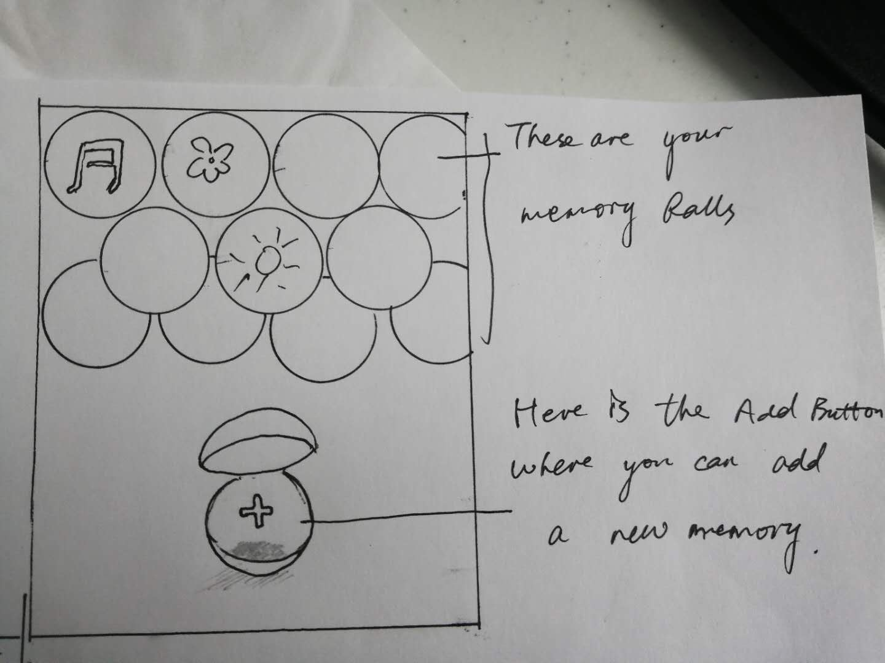
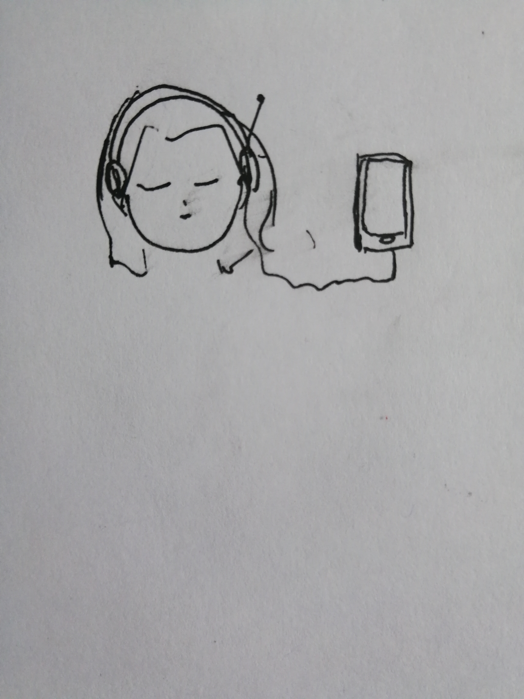
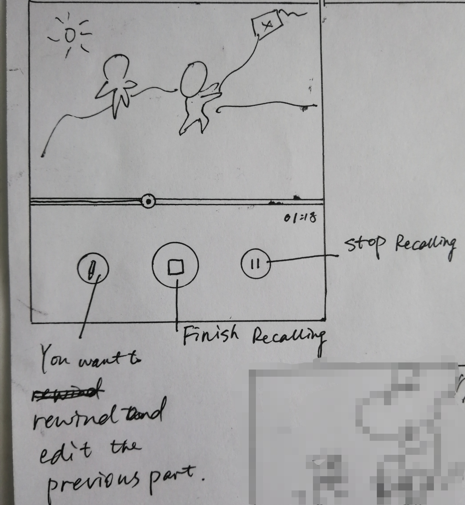
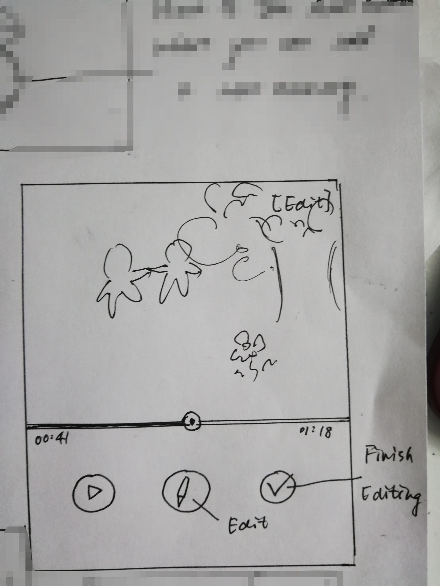
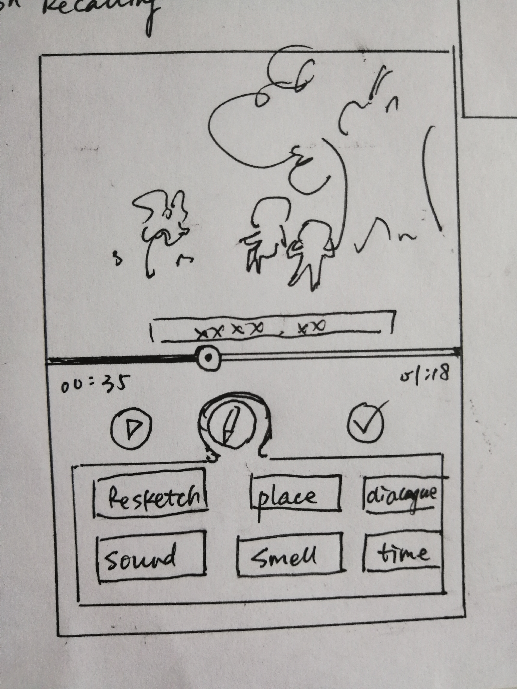
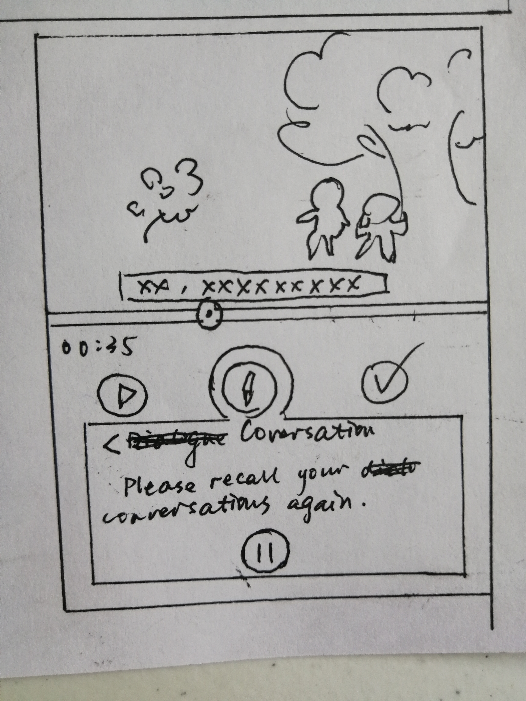

# Memory Ball

### This is an app where you can visualize all your memories and save them in the form of video. And then you can watch your memory like a movie!

+ On the home page, you can find all your saved memories in the memory balls. Under the memory balls, there is an empty ball where you can click to add a new memory.

+ Click the add button and go to the recalling page where you can add a new memory.
  You will need to wear a thing like a headset which can capture what you
  are recalling and show them on the screen. By clicking the finish recalling button you can finish recording and save it to you memory balls.
  

  
  + By clicking the edit button, you can rewind and edit the previous part. For
  example, you can add a conversation or change the color of the kite when suddenly you realize there were some
  lapses and you want to go back and correct that part of memory.
  
  You can drag the button to decide where the beginning point of the part that you want to edit is. There are different kinds of details you can
  choose to alter. You can click the check mark to finish editing and go back to the recalling page.
  

  + Choose a kind of detail you would like to alter such as the conversation. Then you can
  begin to change the conversation by rethinking about this part. Press the stop button when you stop rethinking.
  
