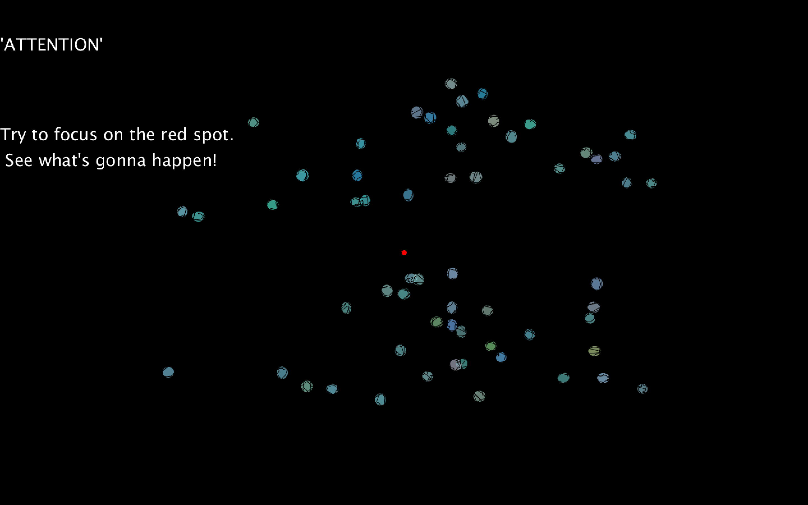

# Homework

* [The Impossible App](/Homework/Impossible-App/MemoryBall.md)
* [Character](https://sherrydqy.github.io/CIM640/Homework/Character/index.html)
* [Character with Interaction](https://sherrydqy.github.io/CIM640/Homework/Character-with-Interaction/index.html)- [p5js code](https://sherrydqy.github.io/CIM640/Homework/Character-with-Interaction/sketch.js)
* [Midterm - Don't overeat](https://sherrydqy.github.io/CIM640/Homework/Midterm/Readme.md)
* [LibraryExplore](https://sherrydqy.github.io/CIM640/Homework/LibraryExplore/Readme.md)
* [Final - Attention](https://sherrydqy.github.io/CIM640/Homework/Final/Attention)
 It's a processing project. You can't open it on web. Sorry.
  * [Test video](https://sherrydqy.github.io/CIM640/Homework/Final/test.mp4)
  * The initial interface looks like this:
  
  * Here is a .gif.
  
