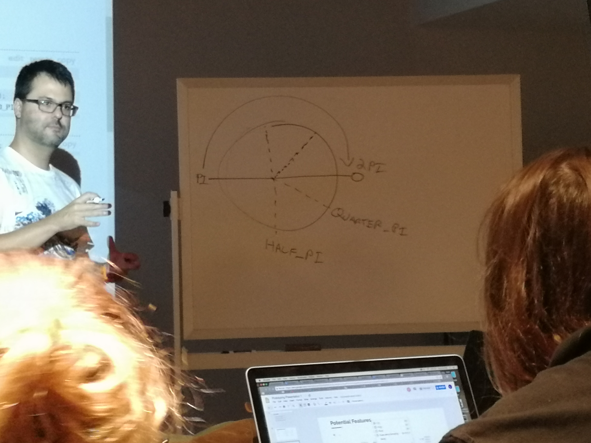

To do list:
+ go to check reddit
+ go to check the company of Thursday
+ how to create/use a mask using p5js
+ review coding!

# Notes for today's Class
+ 
+ terminologies
> global variables
  local variables
  scope
