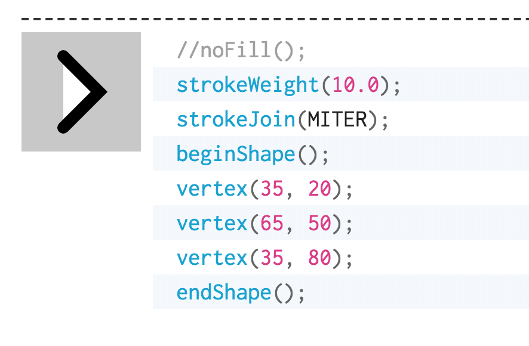

# Assignment:
> create a character

### openClipart
> 这个网站可以找icon，clipart然后拉到你的p5js里面，然后你就不用画啦

### ellipseMode(CORNER);
> 这个左上角，指的是，以这个mode作内切圆的矩形的左上角

## outline
> nofill();
> fill(rgb);
> stroke(rgb);
> strokeWeight(rgb);
> noStroke();
> smooth();
> noSmooth();

> 除了画line以外，其他所有曲线啊，箭头啊这种线条，一定记得先写 noFill();

> image()函数貌似只能在draw里面用
>color (rgba) 也只能在draw函数里面用
