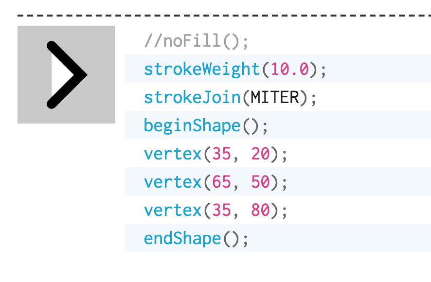

#09/04/2018

#### To do list:
+ go to check reddit
+ go to check the company of Thursday
+ how to create/use a mask using p5js
+ review coding!

### Notes for today's Class
+ 
+ terminologies
> global variables
  local variables
  scope

# 09/06/2018

### Assignment:
> create a character

### openClipart
> 这个网站可以找icon，clipart然后拉到你的p5js里面，然后你就不用画啦

### ellipseMode(CORNER);
> 这个左上角，指的是，以这个mode作内切圆的矩形的左上角

### outline
> nofill();
> fill(rgb);
> stroke(rgb);
> strokeWeight(rgb);
> noStroke();
> smooth();
> noSmooth();

> 除了画line以外，其他所有曲线啊，箭头啊这种线条，一定记得先写 noFill();

> image()函数貌似只能在draw里面用
>color (rgba) 也只能在draw函数里面用

# 09/11/2018

### phrase: pick it up from last episode

### training video from Daniel Shiffman, check that out

### triangle is drawn clockwise

### what is the atom-live-server for?
 To create a sandbox?( what is a sandbox?)

### Review 路径表示法

### The process you design a program
> Start with the abstract interface - the big picture
  think about what are inputs and outputs?
  e.g. input: mouseX
       output: what is the users gonna see?

>     then: simple instruction

>     then fill in the gaps: how do you designate your interface area, e.g. divide your interface into different parts
 and how do you represent these areas with parameters?
 e.g. the left-half of the canvas : positionX: [0 - width/2);
      the right-half of the canvas positionY: [width/2, width]);

### if() 条件式不能连等，应该是 0<=a && a<2, 而不是 0<=a<2

### 设计的时候注意要考虑到边界情况，当你在边界的时候应该做什么

# 09/13/2018

### dist(x1,y1,x2,y2) //to calculate the distance between two points

### the frequency of drawing (frameRate(X)) default value is 50 rate a sec;

# 09/18/2018
